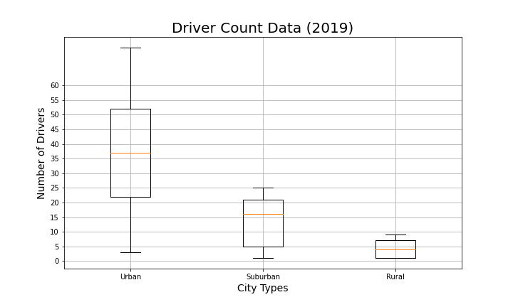

# 1. PyBer Analysis
## The purpose of the PyBer analysis : 
This analysis is for a Pyber which is a python based ride sharing app. We are preparing visualizations from a large csv file. We will be exploring different charts in order to find the best chart for this analysis. Also derive the linear regression equations for from the data.
As it is such a large dataset(from two large csv files which have the city data and the ride data) , we came up with the following list of steps and deliverables:
•	Import your data into a Pandas DataFrame.
•	Merge your DataFrames.
•	Create a bubble chart that showcases the average fare versus the total number of rides with bubble size based on the total number of drivers for each city type, including urban, suburban, and rural.
•	Determine the mean, median, and mode for the following:
o	The total number of rides for each city type.
o	The average fares for each city type.
o	The total number of drivers for each city type.
•	Create box-and-whisker plots that visualize each of the following to determine if there are any outliers:
o	The number of rides for each city type.
o	The fares for each city type.
o	The number of drivers for each city type.
•	Create a pie chart that visualizes each of the following data for each city type:
o	The percent of total fares.
o	The percent of total rides.
o	The percent of total drivers.

We will be working on the following two deliverables in this analysis :
•	Deliverable 1: A ride-sharing summary DataFrame by city type
•	Deliverable 2: A multiple-line chart of total fares for each city type
## 2. Results:
There is a description of the differences in ride-sharing data among the different city types. Ride-sharing data include the total rides, total drivers, total fares, average fare per ride and driver, and total fare by city type. (7 pt)
a.	Pyber Ride Sharing Data(2019) : In our file Pyber.ipnyb, We created a bubble chart that shows the Pyber Ride Sharing Data(2019) displaying the number of rides in relation to the Average Fare($) for all city types. 

 
 

Conclusion : 
As per the above bubble graph, it shows that the Average Fare in Rural areas is a lot higher than in urban areas…also reflecting that the number of rides in rural areas is very less. We can see a in-direct co-relation here in the number of rides and the price.

b.	Ride Count Data, Ride Fare Data, Driver Count Data : In our file Pyber.ipnyb, We created a box-and-whisker plots that visualize each of the following to determine if there are any outliers:
a.	The number of rides for each city type.
b.	The fares for each city type.
c.	The number of drivers for each city type.

Conclusion :
There is one outlier in the urban ride count data. Also, the average number of rides in the rural cities is about 4- and 3.5-times lower per city than the urban and suburban cities, respectively.
The average fare for rides in the rural cities is about $11 and $5 more per ride than the urban and suburban cities, respectively
The average number of drivers in rural cities is nine to four times less per city than in urban and suburban cities, respectively.	
c.	 City type Percentage of Total Fares, Total Rides and Total Drivers : We created pie charts to analyze these percentages.

Conclusion :
The above charts clearly reflect that the highest percentage of total fares, total rides and total drivers is in the urban city type.

This could be due to the high demand in the urban cities.

d. In file Pyber_Challenge.ipnyb, in order to understand the difference in the data between all the city types we created summary data frame (pyber_summary_df)

d.	Citytype_Datewise_Fare Total : First we got the Fare total for each city type for each date recorded in the csv data file from the period 01-01-2019 to 04-29-2019.
![ Pyber Ride Sharing Data(2019)(analysis/City_type_Datewise_FareTotal.png)
The above data was them grouped together by week, to get the weekly sum of city type fares.

e. A multiple-line chart of total fares for each city type : Finally using the object-oriented interface method and the df.plot() method, as well as the Matplotlib "fivethirtyeight" graph style, we created the line chart to show the difference in the weekly fares of the different city types.

## 3. Summary:
a.	There is a statement summarizing three business recommendations to the CEO for addressing any disparities among the city types. (4 pt)
b.	
e.	

As per the above analysis, following are the business recommendations for addressing the disparities.
1.	Urban city type is the highest performing in regards to the number of rides. It has the highest number of rides, fare total and the drivers in comparison to the other two types of cities. The total rides in the urban city types was 1625 and the total drivers was 2405, which proves that the demand is 38% less than the available supply of drivers. So, we need more information to analyze this issue. Few factors to look at would be:

    i.	Analyze data from different periods and to create a line graph to identify the demand and supply difference.

    ii.	Understand if there were any additional factors that led to this off balance between the demand and supply, Factors like weather, pandemic etc.

    iii.	Get reviews from the riders after every ride to understand how the riders experience can be improved in order to increase the overall demand. Like making booking rides easier on their app, reducing the rider’s wait time, training drivers on skills of friendliness etc.

    iv.	Offering special discounts during special events could help boost the demand.

2.	Suburban : The suburban area has been doing really well. The total rides in the suburban city types was 625 and the total drivers was 490, which proves that the demand is reasonable.

    i.	Analyze data from different periods and to create a line graph to identify the demand and supply difference.

    ii.	Get reviews from the riders after every ride to understand how the riders experience can be improved in order to increase the overall demand.

    iii.	Linking special discounts with special local events and use those events to promote their discounts and vice versa can really help boost the demand more.

3.	Rural : The rural area has the highest average fare per ride and the lowest number of rides as compared to the other two city types. This proves that the rural city types use Pyber ride sharing only for emergencies and prefer driving their own vehicle. Also the number of drivers in rural areas is comparatively low leading to higher fare per driver. Following measures can be taken in order to boost the demand :

    i.	Encouraging local vendors to create events that can help increase demand for share riding.

    ii.	Linking special discounts with special local events and use those events to promote their discounts and vice versa can really help boost the demand more.

    iii.	Giving a discount card or one free ride after reaching a total of 10 rides, to riders after completing the ride will help them take more rides in future.
